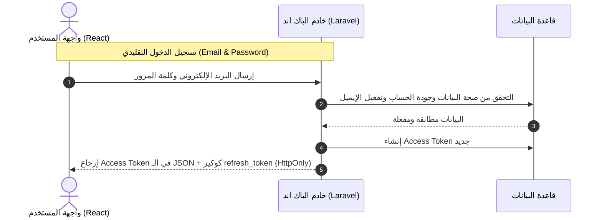
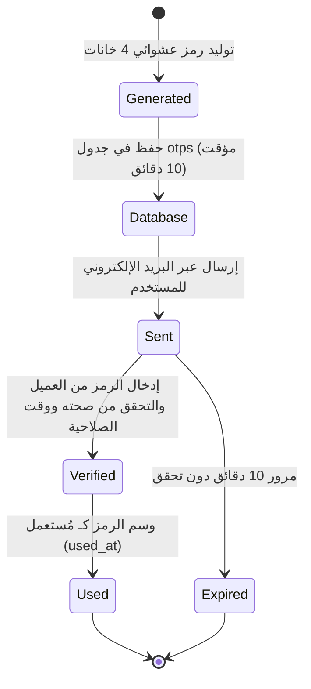
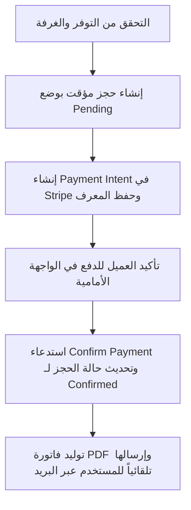

# توثيق وهندسة الباك اند لمنصة فايكا للفنادق (Vayka Backend Documentation) 🏨

مرحباً بك في الدليل الشامل والاحترافي لهندسة الباك اند الخاص بمشروع منصة **فايكا (Vayka)** للبحث وحجز الفنادق. تم تصميم هذا الباك اند وتطويره باستخدام إطار العمل **Laravel** مع الالتزام بأفضل الممارسات البرمجية والأمنية لضمان الأداء العالي والحماية القصوى لبيانات المستخدمين والمعاملات المالية.

---

## 🗂️ 1. دليل تخريط الميزات لمنطق الأعمال والملفات المسؤول عنها (Feature-to-File Logic Mapping)

لتسهيل الوصول إلى الملفات وتعديل الكود، يوضح الجدول التالي ميزات الباك اند الرئيسية والملفات المحددة التي تدير هذا المنطق:

| الميزة / منطق العمل | الملف المسؤول (File Path) | الدالة أو الكود المحدد (Specific Logic) |
| :--- | :--- | :--- |
| **إنشاء مستخدم جديد (Registration)** | [AuthController.php](file:///c:/Users/dell/Herd/hotel-server/app/Http/Controllers/Api/AuthController.php) | دالة `register()` |
| **تسجيل الدخول التقليدي وإصدار كوكيز الـ Refresh** | [AuthController.php](file:///c:/Users/dell/Herd/hotel-server/app/Http/Controllers/Api/AuthController.php) | دالة `login()` |
| **تسجيل الدخول السريع عبر Google Firebase** | [AuthController.php](file:///c:/Users/dell/Herd/hotel-server/app/Http/Controllers/Api/AuthController.php) | دالة `googleLogin()` |
| **التجديد الصامت للتوكنات (Silent Refresh)** | [AuthController.php](file:///c:/Users/dell/Herd/hotel-server/app/Http/Controllers/Api/AuthController.php) | دالة `refresh()` |
| **توليد وإرسال رموز التحقق المؤقتة (OTP)** | [AuthController.php](file:///c:/Users/dell/Herd/hotel-server/app/Http/Controllers/Api/AuthController.php) | دالة `generateAndSendOtp()` ودالة `verifyOtp()` |
| **نموذج وهيكل الـ OTP** | [Otp.php](file:///c:/Users/dell/Herd/hotel-server/app/Models/Otp.php) | تعريف الحقول ووظائف الفحص `isExpired()` |
| **تحديث الملف الشخصي ورفع الصورة الشخصية** | [AuthController.php](file:///c:/Users/dell/Herd/hotel-server/app/Http/Controllers/Api/AuthController.php) | دوال `updateProfile()`, `uploadAvatar()`, `deleteAvatar()` |
| **تحديث توكن الإشعارات (FCM Token)** | [AuthController.php](file:///c:/Users/dell/Herd/hotel-server/app/Http/Controllers/Api/AuthController.php) | دالة `updateFcmToken()` |
| **إعدادات مدة التوكن والمصادقة لـ Sanctum** | [sanctum.php](file:///c:/Users/dell/Herd/hotel-server/config/sanctum.php) | خيار التعديل `expiration` |
| **نموذج وعلاقات المستخدم** | [User.php](file:///c:/Users/dell/Herd/hotel-server/app/Models/User.php) | تعريف الصلاحيات والعلاقات مع الفنادق والحجوزات |
| **البحث عن الفنادق وفلترتها حسب سعر الغرفة** | [HotelController.php](file:///c:/Users/dell/Herd/hotel-server/app/Http/Controllers/Api/HotelController.php) | دالة `index()` (تحتوي على استعلام فلترة أسعار الغرف والترتيب) |
| **إضافة وعرض الفنادق الأساسي** | [HotelController.php](file:///c:/Users/dell/Herd/hotel-server/app/Http/Controllers/Api/HotelController.php) | دوال `store()` و `show()` |
| **نموذج وعلاقات الفنادق** | [Hotel.php](file:///c:/Users/dell/Herd/hotel-server/app/Models/Hotel.php) | العلاقات مع الغرف والتقييمات |
| **إدارة الغرف وحالتها** | [RoomController.php](file:///c:/Users/dell/Herd/hotel-server/app/Http/Controllers/Api/RoomController.php) | دوال العرض والتسجيل الخاصة بالغرف |
| **نموذج وعلاقات الغرف** | [Room.php](file:///c:/Users/dell/Herd/hotel-server/app/Models/Room.php) | حساب توفر التواريخ عبر `isAvailableForDates()` |
| **التحقق من توافر الحجز وإنشاء المعاملة** | [BookingService.php](file:///c:/Users/dell/Herd/hotel-server/app/Services/BookingService.php) | دوال `getAvailability()`, `calculatePricing()`, `createBooking()` |
| **طلبات الحجز وإلغائه عبر الـ API** | [BookingController.php](file:///c:/Users/dell/Herd/hotel-server/app/Http/Controllers/Api/BookingController.php) | دوال `store()`, `checkAvailability()`, `cancel()` |
| **إلغاء الحجز واحتساب قيمة الاسترداد المالي** | [BookingService.php](file:///c:/Users/dell/Herd/hotel-server/app/Services/BookingService.php) | دالة `cancelBooking()` (تتكامل مع خدمة الدفع) |
| **إنشاء وتأكيد عمليات الدفع لـ Stripe** | [PaymentController.php](file:///c:/Users/dell/Herd/hotel-server/app/Http/Controllers/Api/PaymentController.php) | دوال `createIntent()` و `confirm()` |
| **معالجة مدفوعات Stripe وتأكيدها محلياً** | [PaymentService.php](file:///c:/Users/dell/Herd/hotel-server/app/Services/PaymentService.php) | دالة `confirmPayment()` (التي تقوم بتحديث الحجز) |
| **توليد الفواتير بصيغة PDF وتنزيلها للعميل** | [ReceiptController.php](file:///c:/Users/dell/Herd/hotel-server/app/Http/Controllers/Api/ReceiptController.php) | دوال `download()` و `preview()` |
| **قالب تصميم الفاتورة** | [booking.blade.php](file:///c:/Users/dell/Herd/hotel-server/resources/views/receipts/booking.blade.php) | تصميم وهيكل الـ HTML/CSS للفاتورة |
| **توليد الفاتورة PDF وإرفاقها بالبريد الإلكتروني** | [PaymentService.php](file:///c:/Users/dell/Herd/hotel-server/app/Services/PaymentService.php) | دالة `confirmPayment()` (كتلة إرسال البريد `Mail::send` مع مرفق الـ PDF) |

---

## 🗺️ 2. هيكل المجلدات وتوزيع الملفات الرئيسي

يتكون المشروع من بنية Laravel القياسية مع توزيع منطقي للملفات كما يلي:

*   **`app/Http/Controllers/Api/`**: يحتوي على متحكمات واجهة برمجة التطبيقات (API Controllers) التي تتعامل مع الطلبات الواردة وتنسيق الاستجابات (مثل المصادقة، الفنادق، الغرف، الحجوزات، والمدفوعات).
*   **`app/Models/`**: يحتوي على نموذج Eloquent التي تمثل جداول قاعدة البيانات والعلاقات بينها (مثل `User`, `Otp`, `Booking`, `Room`, `Hotel`, `Payment`).
*   **`app/Services/`**: طبقة منطق الأعمال (Business Logic Layer) لعزل العمليات المعقدة بعيداً عن المتحكمات (مثل `PaymentService` لتأكيد الدفع والتواصل مع Stripe، و `BookingService` لإدارة العمليات الحسابية للحجز).
*   **`app/Traits/`**: يحتوي على الصفات المشتركة لإعادة الاستخدام، مثل `ApiResponse` لتأحيد تنسيق الردود.
*   **`app/Policies/`**: لحماية المسارات والتحقق من صلاحيات المستخدمين والتحكم بالوصول.
*   **`config/`**: ملفات إعدادات التطبيق، ومن أهمها `sanctum.php` لإعداد مصادقة التوكنات والجلسات.
*   **`resources/views/receipts/`**: يحتوي على قوالب Blade الخاصة بالفواتير والتي يتم تحويلها إلى ملفات PDF.
*   **`routes/api.php`**: ملف تعريف المسارات لجميع واجهات برمجة التطبيقات (API Endpoints).

---

## 🛡️ 3. نظام المصادقة وإدارة الهوية (Authentication System)

يعتمد النظام بالكامل على **Laravel Sanctum** كآلية أساسية للمصادقة وحماية المسارات، مع توفير آليات تسجيل دخول متعددة وحماية متقدمة للتوكنات.



### 🔑 3.1 أنواع وتفاصيل التوكنات (Tokens Details)

يتم توليد نوعين من التوكنات عند نجاح عملية تسجيل الدخول:

1.  **Access Token (رمز الوصول للـ API)**:
    *   **الملف المسؤول**: دالة `login()` في [AuthController.php](file:///c:/Users/dell/Herd/hotel-server/app/Http/Controllers/Api/AuthController.php).
    *   **طريقة التوليد**: يتم توليده عبر التابع `$user->createToken('access_token')->plainTextToken`. يتم تخزين الرمز مشفراً (Hash) في جدول `personal_access_tokens` في قاعدة البيانات.
    *   **طريقة الاستخدام**: يُرسل كجزء من رد الـ JSON، وتتولى الواجهة الأمامية حفظه وإرساله في ترويسة جميع الطلبات المحمية كـ `Authorization: Bearer <access_token>`.
    *   **مدة الصلاحية (Lifespan)**: تم تحديد صلاحية التوكن بـ **60 دقيقة** (ساعة واحدة) ويتم إدارتها عبر الخيار `expiration` في ملف الإعدادات `config/sanctum.php` كما يلي:
        ```php
        'expiration' => 60,
        ```

2.  **Refresh Token (رمز التحديث صامت الجلسة)**:
    *   **الهدف**: توفير وسيلة لتجديد الجلسة والحصول على توكن جديد دون إجبار المستخدم على إعادة إدخال بيانات الدخول عند انتهاء صلاحية الـ Access Token (بعد ساعة).
    *   **طريقة التخزين**: يُحفظ التوكن في كوكيز مشفرة ومحمية باسم `refresh_token` تُرسل تلقائياً مع الرد.
    *   **أمن الكوكيز**: الكوكيز مضبوطة بخصائص عالية الأمان لمنع الاختراق وسرقة التوكن:
        *   **`HttpOnly`**: تعني أنه لا يمكن لسكربتات الجافاسكريبت في المتصفح قراءة أو تعديل الكوكيز، مما يحميها تماماً من هجمات حقن النصوص البرمجية (XSS).
        *   **`Secure`**: تُرسل الكوكيز فقط عبر بروتوكول HTTPS الآمن لمنع التنصت (Man-in-the-Middle).
        *   **`SameSite = Lax`**: تمنع إرسال الكوكيز مع الطلبات العابرة للمواقع لحماية المستخدم من هجمات تزوير الطلبات عبر المواقع (CSRF).
    *   **مدة الصلاحية**: **أسبوع كامل** (7 أيام أو 10080 دقيقة). ويتم إنشاؤها عبر سطر الكود التالي في `AuthController.php`:
        ```php
        cookie('refresh_token', $token, 60 * 24 * 7, '/', null, true, true, false, 'lax')
        ```

### 🔄 3.2 آلية التجديد الصامت للتوكن (Silent Refresh)

*   **الملف المسؤول**: دالة `refresh()` في [AuthController.php](file:///c:/Users/dell/Herd/hotel-server/app/Http/Controllers/Api/AuthController.php).
*   **آلية العمل**: عند انتهاء الـ Access Token (بعد مرور 60 دقيقة)، تقوم الواجهة الأمامية بإرسال طلب إلى المسار المخصص للتجديد `/api/auth/refresh`:
    1. يقرأ الباك اند كوكيز الـ `refresh_token` المرسلة تلقائياً مع الطلب.
    2. يتم فحص التوكن عبر `PersonalAccessToken::findToken($refreshToken)`.
    3. في حال كان التوكن صالحاً وغير منته الصلاحية (عمره أقل من أسبوع):
       * يُلغى التوكن القديم ويتم إصدار Access Token جديد يُرجع في رد الـ JSON.
       * يُعاد تحديث كوكيز الـ `refresh_token` لفترة أسبوع إضافي لضمان استمرارية الجلسة دون مقاطعة.

---

## ✉️ 4. نظام التحقق والمصادقة بالرموز المؤقتة (OTP Lifecycle)

تعتمد المنصة على الـ **OTP** (One-Time Password) كعنصر حماية إضافي ومصادقة بدون كلمات مرور للعمليات الحساسة (مثل تأكيد الحساب، إعادة تعيين كلمة المرور، أو تسجيل الدخول السريع).



### ⚙️ 4.1 هيكل جدول الرموز المؤقتة (`otps`)
*   **الملف المسؤول**: [Otp.php](file:///c:/Users/dell/Herd/hotel-server/app/Models/Otp.php)
*   يحتوي جدول `otps` على الحقول التالية:
    *   `email`: البريد الإلكتروني المستهدف.
    *   `code`: رمز التحقق المكون من 4 أرقام.
    *   `type`: نوع الرمز ويأخذ إحدى القيم: (`verify_email` للتحقق بعد التسجيل، `reset_password` لاستعادة الحساب، `login` للدخول السريع).
    *   `expires_at`: تاريخ ووقت انتهاء صلاحية الرمز.
    *   `used_at`: تاريخ ووقت استخدام الرمز (يكون فارغاً `null` عند الإنشاء).

### ⏳ 4.2 دورة حياة الـ OTP
*   **الملف المسؤول**: دالة `generateAndSendOtp()` ودوال التحقق في [AuthController.php](file:///c:/Users/dell/Herd/hotel-server/app/Http/Controllers/Api/AuthController.php).
1.  **التوليد (Generation)**: يتم توليد رمز عشوائي مكون من 4 خانات وإضافة أصفار لليسار لضمان بقائه رباعياً دائماً:
    ```php
    $code = str_pad(random_int(0, 9999), 4, '0', STR_PAD_LEFT);
    ```
2.  **مدة الصلاحية (Lifespan)**: تبلغ صلاحية الرمز **10 دقائق** فقط من وقت التوليد. ويتم تعيينها كالتالي:
    ```php
    'expires_at' => now()->addMinutes(10)
    ```
3.  **الإرسال (Sending)**: يُرسل الرمز عبر البريد الإلكتروني للمستخدم باستخدام خادم البريد المعتمد كرسالة نصية بسيطة وسريعة لضمان الوصول الفوري.
4.  **التحقق والاستهلاك (Verification & Consumption)**: عند قيام المستخدم بإدخال الرمز، يتحقق الخادم من الشروط التالية مجتمعة:
    *   البريد الإلكتروني متطابق.
    *   الرمز متطابق.
    *   النوع متطابق.
    *   حقل `used_at` فارغ (لم يتم استخدام الرمز سابقاً).
    *   الوقت الحالي أقل من وقت الانتهاء `expires_at` (`expires_at > now()`).
5.  في حال نجاح التحقق، يتم فوراً وسم الرمز كـ مستهلك عبر وضع التاريخ الحالي في حقل `used_at` (لمنع هجمات إعادة إرسال الطلبات Replay Attacks) عبر استدعاء التابع `markAsUsed()`:
    ```php
    $otp->used_at = now();
    $otp->save();
    ```

---

## 🌐 5. تسجيل الدخول عن طريق Google (Google Authentication Flow)

*   **الملف المسؤول**: دالة `googleLogin()` في [AuthController.php](file:///c:/Users/dell/Herd/hotel-server/app/Http/Controllers/Api/AuthController.php).
*   **آلية العمل**:
    1.  **العميل (Client)**: يقوم بمصادقة المستخدم مع Google وتوليد ID Token خاص بـ Firebase، ثم يرسله إلى المسار `/api/auth/google-login`.
    2.  **الباك اند (Backend)**:
        *   يقوم بتحميل شهادات Google العامة المعتمدة وفك تشفير الـ Token للتأكد من توقيعه الرقمي وخلوه من التلاعب عبر خوارزمية التشفير `RS256`.
        *   يقوم بالتحقق من الحقول القياسية (Claims) مثل الجمهور `aud` والجهة المصدرة `iss` ومطابقتها لمعرف مشروع Firebase المحدد في ملف الـ `.env` للتأكد من أن التوكن صادر لمنصتنا تحديداً.
        *   يستخرج البريد الإلكتروني والاسم والصورة الشخصية للمستخدم.
        *   يبحث عن المستخدم بقاعدة البيانات؛ فإذا كان مسجلاً سابقاً يتم تحديث بيانات صورته ووسمه كمفعل، وإذا لم يكن مسجلاً، يتم إنشاء حساب جديد وكلمة مرور عشوائية وحفظ الحساب مفعل تلقائياً.
        *   يُصدر الباك اند Access Token للمتصفح ويرسل كوكيز الـ `refresh_token` بنفس آلية المصادقة التقليدية تماماً لتوحيد الجلسات.

---

## 💳 6. دورة حياة الحجز والمدفوعات الإلكترونية وإرسال الفواتير

تتكامل المنصة مع بوابة الدفع الشهيرة **Stripe** لتقديم عملية دفع آمنة وسلسة:



1.  **التحقق والطلب مبدئياً**:
    *   **الملف المسؤول**: دالة `checkAvailability()` في [BookingController.php](file:///c:/Users/dell/Herd/hotel-server/app/Http/Controllers/Api/BookingController.php) والتي تستعلم من [BookingService.php](file:///c:/Users/dell/Herd/hotel-server/app/Services/BookingService.php).
    *   يتم فحص توافر الغرفة خلال التواريخ المحددة وعدم وجود تعارض عبر `BookingService::getAvailability`.
2.  **إنشاء نية الدفع (Payment Intent)**:
    *   **الملف المسؤول**: دالة `createIntent()` في [PaymentController.php](file:///c:/Users/dell/Herd/hotel-server/app/Http/Controllers/Api/PaymentController.php).
    *   يتم استدعاء `/api/payments/create-intent` لإنشاء سجل دفع مؤقت والتواصل مع Stripe لإنشاء نية دفع بالمبلغ الإجمالي.
    *   يُرجع السيرفر الـ `client_secret` الخاص بـ Stripe للواجهة الأمامية لإتمام عملية الدفع بأمان دون مرور بيانات البطاقة عبر خوادمنا الخاصة (الالتزام بمعايير PCI-DSS).
3.  **تأكيد الدفع وإصدار الفاتورة**:
    *   **الملف المسؤول**: دالة `confirm()` في [PaymentController.php](file:///c:/Users/dell/Herd/hotel-server/app/Http/Controllers/Api/PaymentController.php) والتي تستدعي دالة `confirmPayment()` في [PaymentService.php](file:///c:/Users/dell/Herd/hotel-server/app/Services/PaymentService.php).
    *   بعد نجاح الدفع على جهاز العميل، يتحقق النظام من حالة المعاملة في Stripe، ويقوم بتحديث حالة الدفع بقاعدة البيانات لـ `succeeded` وحالة الحجز لـ `confirmed`.
    *   **إرسال الفاتورة تلقائياً**: فور التأكيد، يقوم النظام بتوليد فاتورة الحجز كملف PDF عالي الجودة متضمناً تفاصيل الفندق والغرفة والمبلغ والدفع (يستخدم قالب [booking.blade.php](file:///c:/Users/dell/Herd/hotel-server/resources/views/receipts/booking.blade.php))، ويرسل بريداً إلكترونياً تلقائياً للمستخدم مرفقاً به الفاتورة كملف PDF مسمى بصيغة `receipt-booking-{id}.pdf` لضمان تجربة مستخدم احترافية وموثوقة.

---

## 📝 7. دليل مسارات الـ API المحمية والمفتوحة

*   **الملف المسؤول**: [api.php](file:///c:/Users/dell/Herd/hotel-server/routes/api.php)
*   جميع مسارات الباك اند معرفة في `routes/api.php` ومحمية بحواجز برمجية (Middlewares):

| المسار | الطريقة | الوصف | الحماية (Middleware) |
| :--- | :--- | :--- | :--- |
| `/api/auth/register` | `POST` | إنشاء حساب جديد للمستخدم | مفتوح |
| `/api/auth/login` | `POST` | تسجيل دخول بالبريد وكلمة المرور | مفتوح |
| `/api/auth/send-otp` | `POST` | طلب إرسال رمز OTP للبريد الإلكتروني | مفتوح |
| `/api/auth/verify-otp` | `POST` | التحقق من رمز الـ OTP وتسجيل الدخول | مفتوح |
| `/api/auth/google-login` | `POST` | تسجيل دخول سريع عبر حساب Google | مفتوح |
| `/api/auth/refresh` | `POST` | تجديد صلاحية التوكن (التحديث الصامت) | مفتوح (يقرأ الكوكيز) |
| `/api/auth/logout` | `POST` | تسجيل الخروج وإتلاف التوكن الحالي | `auth:sanctum` |
| `/api/auth/user` | `GET` | جلب بيانات المستخدم المسجل حالياً | `auth:sanctum` |
| `/api/auth/profile` | `PUT` | تحديث البيانات الشخصية للمستخدم | `auth:sanctum` |
| `/api/hotels` | `GET` | البحث وفلترة الفنادق (الأسعار، التقييم، إلخ) | مفتوح |
| `/api/bookings` | `POST` | إنشاء حجز جديد في النظام | `auth:sanctum` |
| `/api/bookings/{id}/receipt/download` | `GET` | تحميل فاتورة الحجز كملف PDF | `auth:sanctum` أو توكن صالح بالرابط |

---

## 🛠️ 8. تشغيل الباك اند في بيئة التطوير والإنتاج

لإعداد وتشغيل النظام بنجاح، اتبع الخطوات التالية:

1.  **تثبيت الحزم والمكتبات**:
    ```bash
    composer install
    ```
2.  **إعداد ملف البيئة (`.env`)**:
    *   قم بنسخ `.env.example` لـ `.env` وتعديل بيانات الاتصال بقاعدة البيانات.
    *   اضبط إعدادات خادم البريد (Gmail SMTP) لإرسال الـ OTP والفواتير.
    *   اضبط مفاتيح Stripe (`STRIPE_KEY` و `STRIPE_SECRET`).
    *   اضبط معرف مشروع Firebase (`FIREBASE_PROJECT_ID`).
3.  **تنفيذ الهجرة والتهيئة (Migrations & Seeding)**:
    ```bash
    php artisan migrate --seed
    ```
4.  **تشغيل خادم التطوير المحلي**:
    ```bash
    php artisan serve
    ```

---
*تم توليد هذا التوثيق ليتطابق بالكامل مع البنية الهندسية للباك اند لمنصة **فايكا**. في حال إضافة مزايا جديدة، يُرجى تحديث هذا المستند لضمان اتساق التوثيق مع الكود المصدري.*
